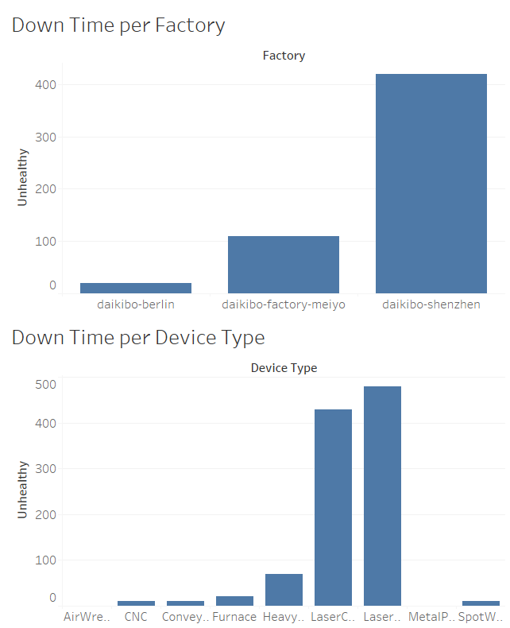
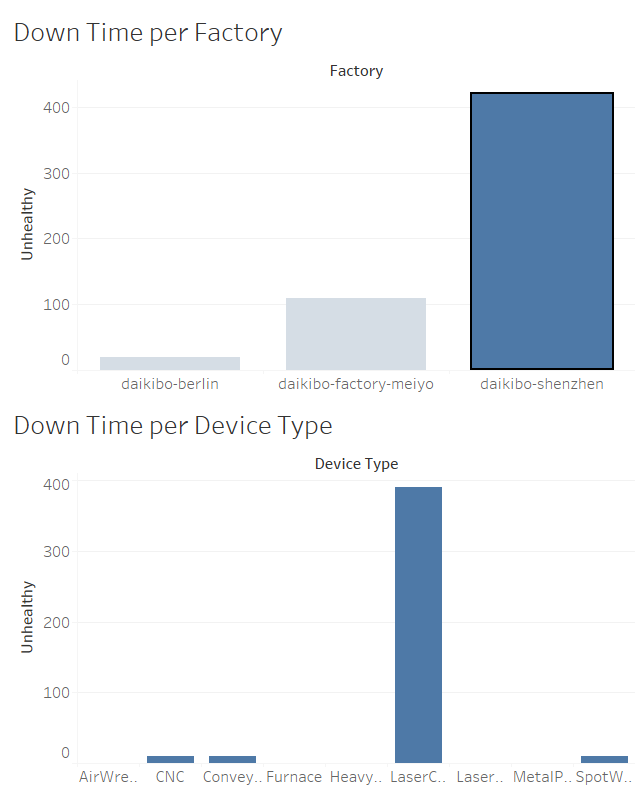
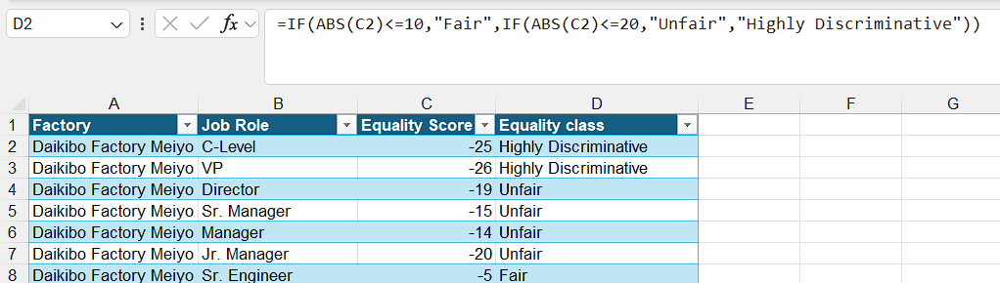

# Deloitte Australia Virtual Job Simulation

This repository contains my completed work for the **Deloitte Australia Forensic Technology & Data Analytics Virtual Job Simulation** offered through [Forage](https://www.theforage.com/). The simulation provided hands-on experience with real-world tasks in forensic investigations and data analysis, helping me build confidence and practical skills in a professional services context.

👉 **View the certificate here:**  
[Certificate of Completion](https://forage-uploads-prod.s3.amazonaws.com/completion-certificates/9PBTqmSxAf6zZTseP/io9DzWKe3PTsiS6GG_9PBTqmSxAf6zZTseP_hCcm2LZfaqq9jcwj6_1749715277667_completion_certificate.pdf)


## 📌 Program Overview

This self-paced simulation is designed to help students explore the kind of work Deloitte’s Forensic and Data teams do. It included real-world scenarios, tools like Excel and Tableau, and focused on analytical thinking, data visualization, and equality assessment.


## ✅ Tasks Completed

### Task 1 – Telemetry Data Analysis with Tableau
**Objective:** Analyze equipment telemetry data to identify potential system downtime.

**Steps Taken:**
- Imported `daikibo-telemetry-data.json` into Tableau.
- Created a calculated field called **"Unhealthy"**, assigning a value of 10 for each unhealthy status (representing 10 minutes of downtime).
- Built two visualizations:
  - **Down Time per Factory** (bar chart)
  - **Down Time per Device Type** (bar chart)
- Created a **dashboard** linking both charts and enabling filter functionality.
- Identified and highlighted the factory with the highest total downtime.


### Task 2 – Gender Pay Equality Analysis with Excel
**Objective:** Analyze compensation equality data across different job roles and locations.

**Steps Taken:**
- Used the provided `Equality Table.xlsx` file containing:
  - Factory
  - Job Role
  - Equality Score (ranging from -100 to +100)
- Created a new column **"Equality Class"** using Excel formula:
  ```excel
  =IF(ABS(C2)<=10, "Fair", IF(ABS(C2)<=20, "Unfair", "Highly Discriminative"))
## 📁 Files

- `Task 1 Downtime Dashboard.twb`
- `Task 2 Equality Table Complete.xlsx`

## 📷 Screenshot



